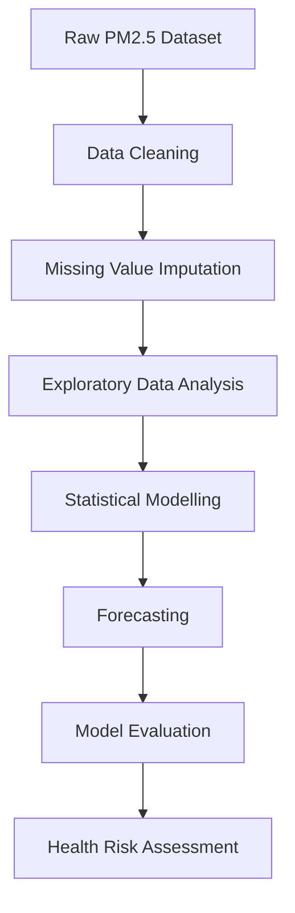

<div align="center">

> Research Portfolio Project | Environmental Statistics | Time Series Analysis | Machine Learning

# PM2.5 Air Quality Analysis and Forecasting in Dhaka, Bangladesh

[](https://www.python.org/)
[](https://jupyter.org/)
[](LICENSE)
[]()
[]()

# PM2.5 Air Quality Analysis and Forecasting in Dhaka

</div>

---

## Project Overview

Air pollution is one of the most critical environmental challenges in Bangladesh, with PM2.5 concentrations frequently exceeding the safety limits recommended by the :contentReference[oaicite:0]{index=0}.

This project develops a complete analytical framework for:

- PM2.5 data preprocessing and cleaning
- Missing value imputation using Kalman Filtering
- Exploratory data analysis and visualization
- Statistical and machine learning modeling
- Time-series forecasting
- Health risk assessment

The project demonstrates how mathematical and statistical techniques can be applied to solve real-world environmental problems.

---

## Objectives

- Analyze PM2.5 concentration patterns.
- Handle missing observations using interpolation/Kalman filtering.
- Explore relationships between air quality and weather variables.
- Visualize seasonal and monthly trends.
- Forecast future PM2.5 concentrations using AutoRegressive (AR) models.
- Assess public health risk categories based on PM2.5 levels.

---
# Project Workflow



## Dataset

The dataset contains:

| Variable | Description |
|-----------|-------------|
| date | Observation date |
| pm25 | PM2.5 concentration (μg/m³) |
| temp_max | Maximum temperature |
| temp_min | Minimum temperature |
| temp_mean | Mean temperature |
| precipitation | Daily precipitation |
| wind_speed | Daily wind speed |

Source:
- US Embassy/Consulate Air Quality Monitoring Data
- Meteorological observations

---

## Methodology

### Step 1: Data Preprocessing

- Load dataset
- Convert date variables
- Handle missing values
- Create cleaned PM2.5 series

### Step 2: Exploratory Data Analysis

- Distribution analysis
- Box plots
- Trend visualization
- Monthly patterns

### Step 3: Missing Data Imputation

Missing PM2.5 observations are filled using interpolation techniques.

### Step 4: Rolling Average Analysis

Calculate:

- 7-day moving average
- 30-day moving average

to identify long-term trends.

### Step 5: Time Series Forecasting

An AutoRegressive (AR) model is fitted to the PM2.5 series.

Forecasting workflow:

1. Split data into training and testing sets.
2. Fit AR model.
3. Generate forecasts.
4. Compare actual and predicted values.

### Step 6: Diagnostic Testing

Model residuals are examined using:

- ACF plots
- PACF plots
- Q-Q plots

### Step 7: Health Risk Assessment

PM2.5 levels are categorized according to air quality health standards:

- Good
- Moderate
- Unhealthy for Sensitive Groups
- Unhealthy
- Very Unhealthy
- Hazardous

---

## Generated Figures

### Figure 1
Box plots of PM2.5 and meteorological variables.

### Figure 2
Missing-value imputation visualization.

### Figure 3
7-day and 30-day rolling averages.

### Figure 4
Model performance comparison.

### Figure 5
AR model forecasting results.

### Figure 6
ACF and PACF diagnostic plots.

### Figure 7
Q-Q plot of residuals.

### Figure 8
Health-risk time series visualization.

### Figure 9
Monthly PM2.5 heatmap.

---

# Installation

```bash
git clone https://github.com/yourusername/PM2.5-Forecasting-Dhaka.git

cd PM2.5-Forecasting-Dhaka

pip install -r requirements.txt
```

---

# Requirements

```text
pandas
numpy
matplotlib
seaborn
scipy
statsmodels
scikit-learn
jupyter
```

---

# Running the Project

```bash
jupyter notebook Final_PM_2_5.ipynb
```

or

```bash
jupyter lab
```

---

# Key Findings

- PM2.5 concentrations frequently exceed recommended safety levels.
- Significant seasonal variations exist.
- Missing observations can be effectively reconstructed using Kalman Filtering.
- Statistical models capture important temporal dynamics.
- Forecasting models provide valuable insights for environmental policy and public health planning.

---

# Future Work

- Incorporate meteorological variables.
- Implement ARIMA and SARIMA models.
- Develop LSTM-based deep learning models.
- Build real-time forecasting dashboards.
- Extend analysis to other cities in Bangladesh.

---

# Research Applications

- Environmental Statistics
- Air Pollution Forecasting
- Time Series Analysis
- Public Health Analytics
- Machine Learning Applications in Environmental Science

---

## Note

Some examples in this notebook use simulated data for demonstrating modeling and visualization techniques. The framework can be directly extended to real PM2.5 monitoring datasets.

# Citation

```bibtex
@misc{ZAMAN2026,
  author = {MD IFTEKHARUZZAMAN},
  title = {PM2.5 Air Quality Analysis and Forecasting in Dhaka, Bangladesh},
  year = {2026},
  publisher = {GitHub},
  url = {https://github.com/yourusername/PM2.5-Forecasting-Dhaka}
}
```

---

# Author

**MD IFTEKHARUZZAMAN**

M.Sc. in Mathematics

Research Interests:

- Applied Mathematics
- Time Series Analysis
- Environmental Statistics
- Machine Learning
- Air Pollution Forecasting

---

# Contact

📧 Email: iftekharuzzaman19@gmail.com
🔗 LinkedIn: [your_linkedin](https://www.linkedin.com/in/md-iftekharuzzaman-9987b5245/)

🔗 Google Scholar: your_google_scholar
```bash
git clone https://github.com/yourusername/PM25-Air-Quality-Forecasting.git
